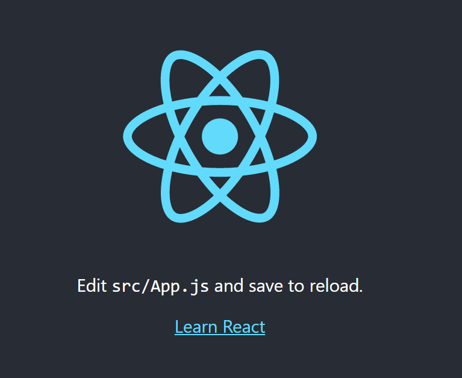
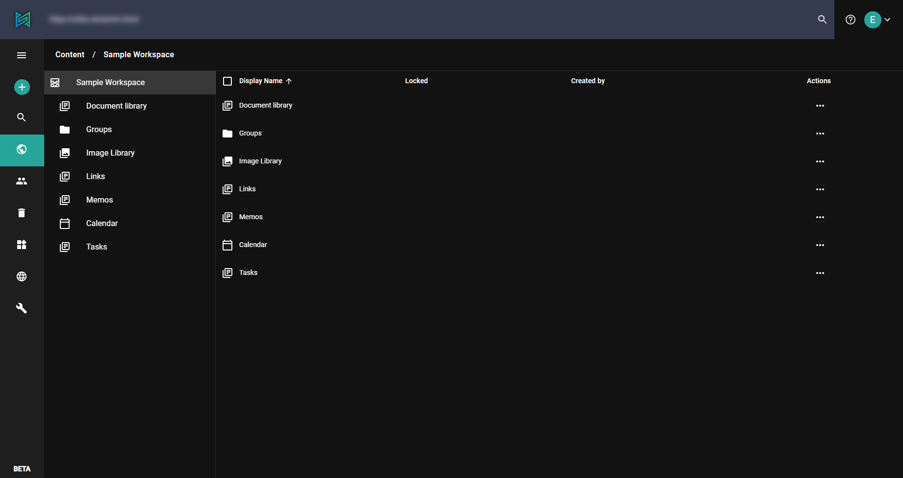
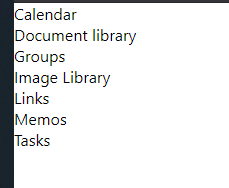
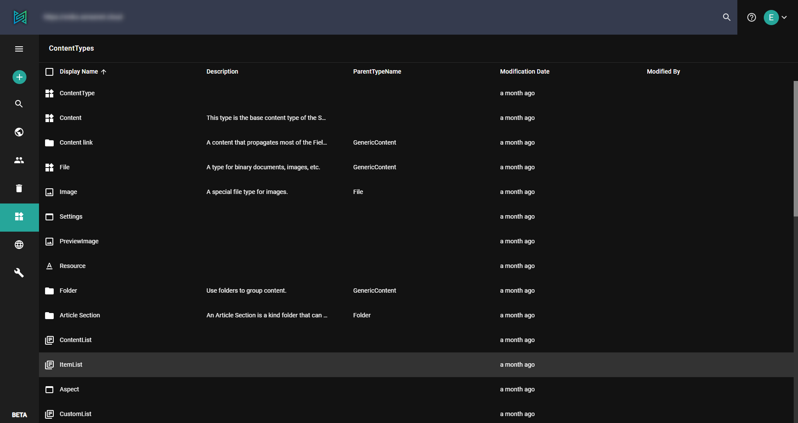
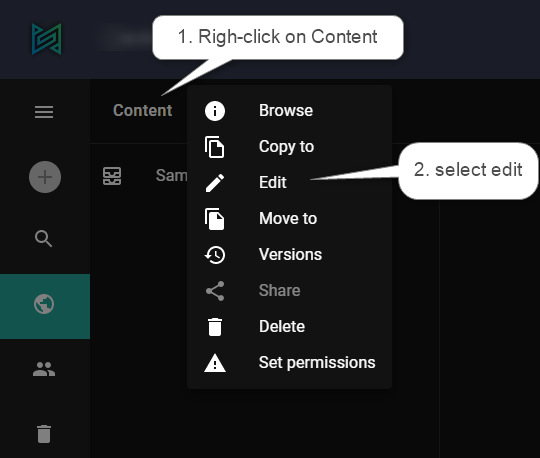
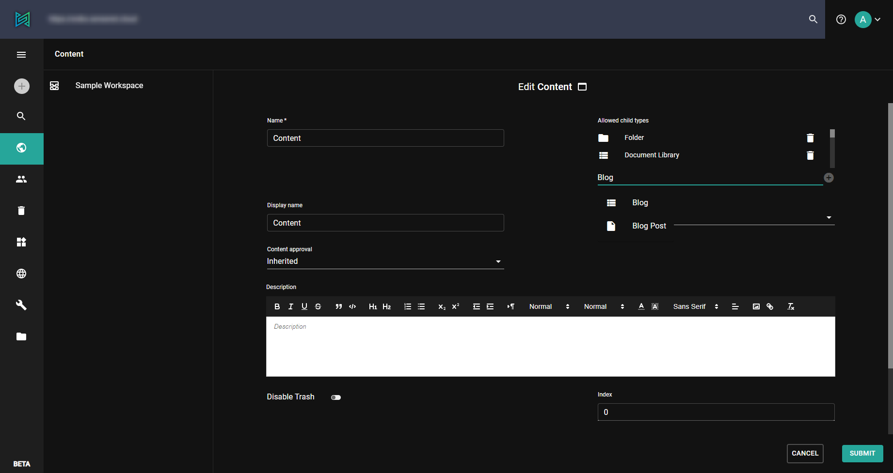

In this tutorial, you will discover how to start a new project using [React](https://reactjs.org/) and sensenet.

# Create react app

First of all you need a React environment what you can create easily with [create-react-app](https://github.com/facebook/create-react-app#creating-an-app).

Download it and run the following command to create a project with the name *example*:

```
yarn create react-app example
```

After creating the environment you can start the app from the root of the project:

```
cd example
yarn start
```

If you open *localhost:3000* in your browser, you should see your new application's greeting page.



To install sensenet core package use the following command:

```
yarn add @sensenet/client-core
```

<div>&nbsp;</div>
<note severity="info"><strong>Important</strong>: In this tutorial we assume that all the content items you are working with are <strong>public</strong> (accessible for visitors). You can make content (for example files or whole folders) public on the admin UI: on the <strong>Set permissions</strong> page hit the Make content public button.
</note>
&nbsp;
&nbsp;
To access private content, please check out [how to add authentication to your application](../authentication/how-to-authenticate-react) in the the related other tutorial.

You should add new dependencies for repository management with:

```
yarn add @sensenet/hooks-react
```

After that you have to create a `configuration.js` file in your project's *src* folder. This file will contain for example the address of your sensenet repository.

```javascript
export const repositoryUrl = <your sensenet repository>
```

You should also create an `app-provider.js` file in your project's *src* folder. That provider will be responsibe for your repository. It should be something like this:

```javascript
import { Repository } from "@sensenet/client-core";
import { RepositoryContext } from "@sensenet/hooks-react";
import { repositoryUrl } from "./configuration";
import React from "react";

export function AppProviders({ children }) {
  return <RepositoryProvider>{children}</RepositoryProvider>;
}

export const RepositoryProvider = ({ children }) => {
  return (
    <RepositoryContext.Provider value={new Repository({ repositoryUrl })}>
      {children}
    </RepositoryContext.Provider>
  );
};
```

This provider will wrap your application in *src/index.js*

```
ReactDOM.render(
  <React.StrictMode>
    <AppProviders>
      <App />
    </AppProviders>
  </React.StrictMode>,
  document.getElementById("root")
);

```

# Work with sensenet

Now you can send requests to the API from your project. For help, see the API docs [here](https://docs.sensenet.com/api-docs/basic-concepts/00-getting-started).

Open the Admin UI [here](http://admin.sensenet.com/). Log in to your sensenet repository and navigate to working with contents using the drawer on the left.



In sensenet, everything is content. Documents, tasks, users, projects, even system configuration files – everything – are stored and managed in the content repository. It is the foundation that makes content management easy and powerful at the same time. All content items are organized in a content tree, so you can always operate through subtrees and with inheritance when managing and presenting content.

For example if you would like to list the Sample Workspace's children you can reach them trough the `repository` instance set in the `app-provider`. Just use the `loadCollection` function anywhere your application. In the following example you can see how:

```javascript
import { useState, useEffect } from "react";
import { useRepository } from "@sensenet/hooks-react";

export const ExampleComponent = () => {
  const repo = useRepository();
  const [data, setData] = useState();

  useEffect(() => {
    async function loadChildrenOfSamplews() {
      const result = await repo.loadCollection({
        path: `/Root/Content/SampleWorkspace`,
        oDataOptions: {
          select: "all",
        },
      });
      setData(result.d.results);
    }
    loadChildrenOfSamplews();
  }, [repo]);

  return (
    <>
      {data?.map((child) => (
        <div>{child.DisplayName}</div>
      ))}
    </>
  );
};
```

The result will be something like the following:



# Creating a blog with sensenet

## Create content types

There are a lot of bult-in content types in sensenet, but you can also create new types according to your business needs.

For example if you would like to build a blog you should add two new content types to your repository: **Blog** and **Post**. Blog will be the container of the posts and it could be an inherited type of the built-in `ItemList`, which is a common container and has all the needed fields.



You can add the following 2 CTDs ([Content Type Definition](/concepts/content-management/03-content-types)) by clicking on the + plus button and selecting *Content Type* in from the dropdown menu. It opens a new page with an editor. Replace the default text inside the editor to the following code (you can define additional fields as you whish, the following code contains the necessary ones).
&nbsp;
<note severity="info">Creating new content types requires administration privileges</note>
&nbsp;&nbsp;

```xml
<ContentType name="Blog" parentType="ItemList" handler="SenseNet.ContentRepository.ContentList" xmlns="http://schemas.sensenet.com/SenseNet/ContentRepository/ContentTypeDefinition">
  <DisplayName>Blog</DisplayName>
  <Description>Container of blog posts</Description>
  <Icon>ContentList</Icon>
  <AllowedChildTypes>
    BlogPost
  </AllowedChildTypes>
  <Fields></Fields>
</ContentType>
```

*Post* is an inherited tyoe of *Article* which contains basic fields for common text content metadata, e.g. author, lead, keywords or content body. With the following code we are extending this with the date of publication.

```xml
<ContentType name="BlogPost" parentType="Article" handler="SenseNet.ContentRepository.GenericContent" xmlns="http://schemas.sensenet.com/SenseNet/ContentRepository/ContentTypeDefinition">
  <DisplayName>Blog Post</DisplayName>
  <Icon>Document</Icon>
  <AllowIncrementalNaming>true</AllowIncrementalNaming>
  <Fields>
      <Field name="Date" type="DateTime">
      <DisplayName>Publish date</DisplayName>
      <Configuration>
        <DateTimeMode>Date</DateTimeMode>
      </Configuration>
    </Field>
  </Fields>
</ContentType>
```

These are the basic content types for the blog. Feel free to try add more fields or modify their configuration, see the [field concept docs](/concepts/fields) for the details.

## Create a posts

Now we are able to fill our blog with some content. Navigate to the content explorer by clicking on the globe icon on the drawer. First we should add our new **Blog** type as an allowed child type on the explorer to be able to create a new Blog container content. Right click on the *Content* item on the breadcrumb and edit it:



Add our **Blog** type to the allowed child types list, do not forget to click on the + icon beside the input and save the form.



After this the dropdown menu at the add (+) button in the drawer should contain a **Blog** as an option as well.

Create a new item with the name *"MyBlog"* by filling the form.

After creating the container you could create blog posts as into your newly created blog. Click on the blog item in the tree then on the add (+) button in the drawer, it will contain *BlogPost* as an option.

Fill the form as well with giving the name *"MyPost"* to the new post content.

## Visualize your post

```javascript
  useEffect(() => {
    async function loadMyPost() {
      const result = await repo.load({
        idOrPath: "/Root/Content/MyBlog/MyPost",
        oDataOptions: {
          select: "all",
        },
      });
      console.log(result.d);

      setData(result.d);
    }
    loadMyPost();
  }, [repo]);
```

You can load *"MyPost"* content from the repository with the `load` function in the example above. It sets *"MyPost"* content as state data. You can style your post as you wish, it is up to you now.

Please check [this page](https://github.com/SenseNet/sn-client/tree/develop/examples) for more examples and [this one](https://docs.sensenet.com/api-docs/basic-concepts/00-getting-started) for the available APIs.
