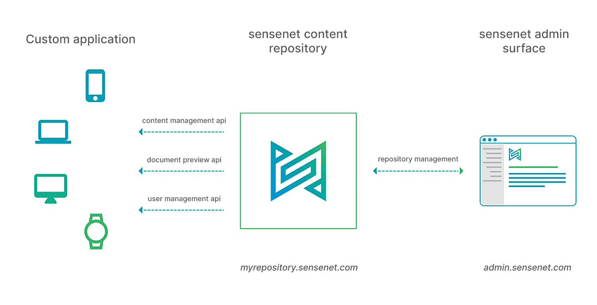

Being a [headless cms](https://docs.sensenet.com/concepts/introduction/02-what-is-headless-cms) sensenet can serve any content-based solution from a simple website to mobile app.

As you can see on the figure below, the basic setup of sensenet contains three top-level parts:

One, is the **content repository** that is the storage and service layer, this is where all your content lives, including users, documents etc. 

The second level is the [**admin surface**](https://docs.sensenet.com/guides/getting-started), which enables you to connect to any of your repositories and perform basic content management tasks. Here you can manage your users, handle permissions, edit your contents, and so on.  

The third part is the **application** that uses the content of the connected repository through API calls. This opens lot of opportunities for you, since this can be any kind of application on any platform (from a simple website to a mobile app). 

To publish your content to multiple platforms, you only need one repository and the same business logic can be used through the whole solution. The different platforms use the same content types, therefore they only need to be defined once at the beginning of your project.

# Complete your website with a mobile app

If you have a simple website built with sensenet creating a mobile application is easier than you think. Based on the existing business logic and content types, you only need to develop your own application. From this point, you can manage all your content simultaneously from the admin surface and your modifications will be visible on every platform since your website and mobile app are working from the same content pool (repository).

# Why you should start your new project with sensenet as a service?

## One repository, multiple platforms
You can easily extend your current solution with a mobile app whenever you want.

## Intuitive admin ui
Editors can publish and modify content easily without specific knowledge, thanks to the easy-to-use admin surface, packed with collaboration features like Office Online Editing, versioning and so on.

## Use your own tech stack
The repository can be accessed through REST APIs so you can use your favorite technology during the development. Now we provide SDKs for JavaScript (TypeScript) or .NET and you are free to implement new connectors for any other technology.

## Additional advantages of having sensenet in SaaS:
- no installation required (easy onboarding) 
- patches and upgrades are taken care of by us 
- no hosting related tasks 
- central admin surface 
- flexible pricing plans (based on # of contents, requests, and users) 
