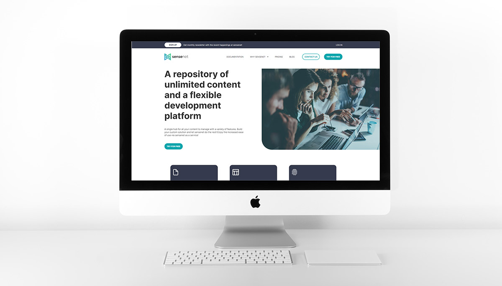
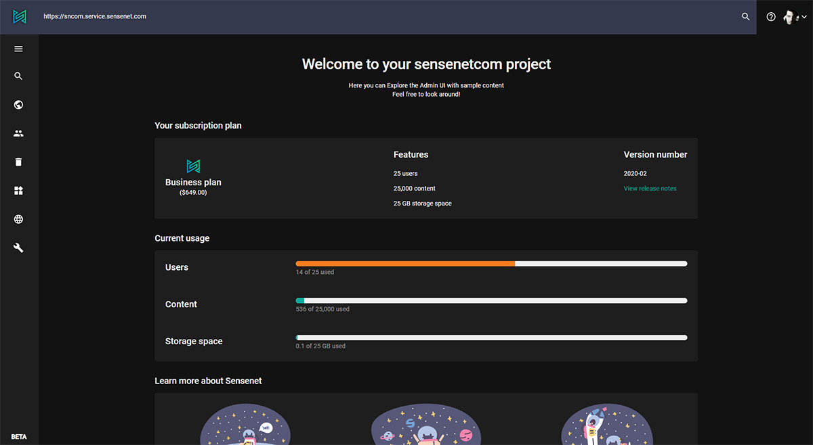

# One repository for all your content
Whether you are working on a corporate website or on a text-based editorial website sensenet is the best choice to achieve your goals and is an even better choice if you want both. A sensenet content repository is capable to handle an infinite variety of [content types](https://docs.sensenet.com/concepts/content-management/03-content-types) in a well-structured tree, so you can easily store and manage all your content for different solutions in one place, making it easy to create unique or shared contents in the same system.

# Quick results in no time
sensenet not only gives you a powerful and stable base of your website projects, but also speed-up the whole process. Different participants can work on different parts of the project at the same time making it agile and super-fast. Your teams will ship updates faster across channels, devices and platforms.

# The best solution for cross-functional teams 
Empower teamwork giving the members sensenet as their rich text editor, content publishing system and development platform at once. While the editors produce text and media, developers can develop the required business logic or custom user interfaces. Don’t worry, they won’t disrupt each other’s work, each of them could have their own permission settings or even their own content branch to keep everything clean and simple. 

# Use your own tech stack 
sensenet lets the developers choose the technology that makes them happy to work with. As an API-first solution it is suitable for giving you the freedom of choosing the right tech stack for the project without tying your hands in anything. 

# Intuitive admin surface
Editors can publish and modify content easily without a specific knowledge, thanks to the easy-to-use [admin surface](https://docs.sensenet.com/guides/getting-started), packed with collaboration features like [Office Online Editing](https://docs.sensenet.com/concepts/collaboration/03-office-online-editing), [versioning](https://docs.sensenet.com/concepts/collaboration/01-versioning) and so on. Developers in this case could also take the advantages of the content-centered approach of sensenet. Since everything is a content in the same repository, configuration files, content types and templates could be managed in the same place, in the same way.

